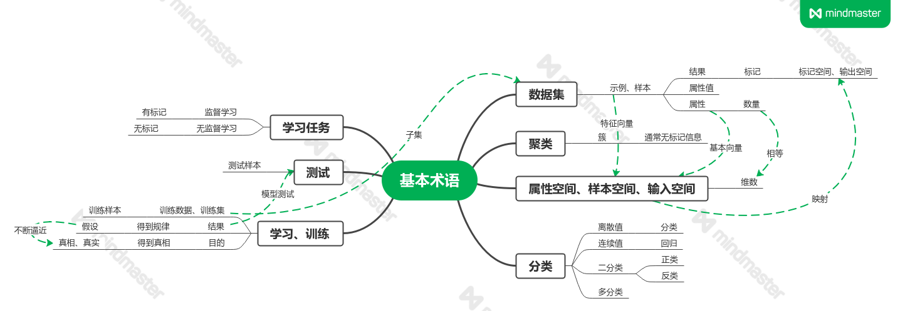

# 第一章 绪论

## 1.1 引言

### 研究的主要内容

- 关于在计算机上从**数据**中产生“模型”(model)的沙发，即“学习算法”(learning algorithm)。
- 假设用P来评估计算机程序在某任务类T上的性能，若一个程序通过利用经验E在任务T上获得了**性能的改善**，则我们可以说关于T和P，该程序对E进行了学习。

## 1.2 基本术语

## 1.3 假设空间

### 归纳学习

特殊 -> 一般 -> 特殊

- 概念学习——不成熟
- “黑箱”模型

#### 学习的过程

在所有假设组成的空间中进行搜索的过程，搜索的目标是找到与训练集“匹配”的假设。

#### 版本空间

假设集合与训练集合的交集

## 1.4 归纳偏好

算法在学习过程中对某种类型假设的偏好

奥卡姆剃刀：若有多个假设和观察一致，则选择最简单的那个（并非唯一可行原则）

NFL定理：要谈论算法的相对优劣，必须要针对具体的学习问题。